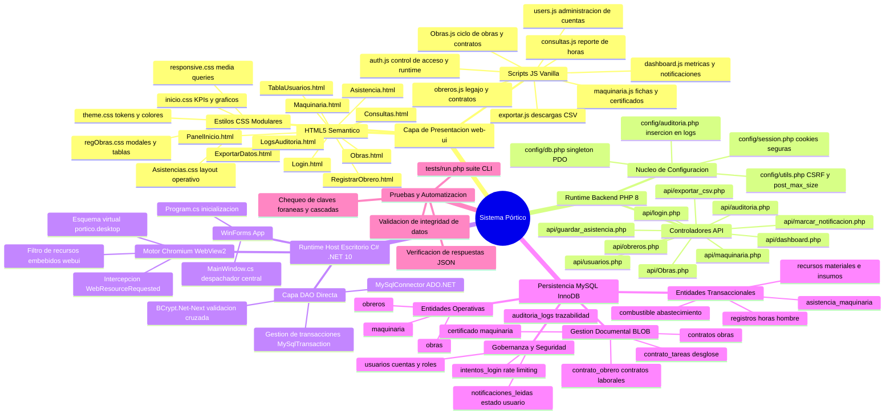
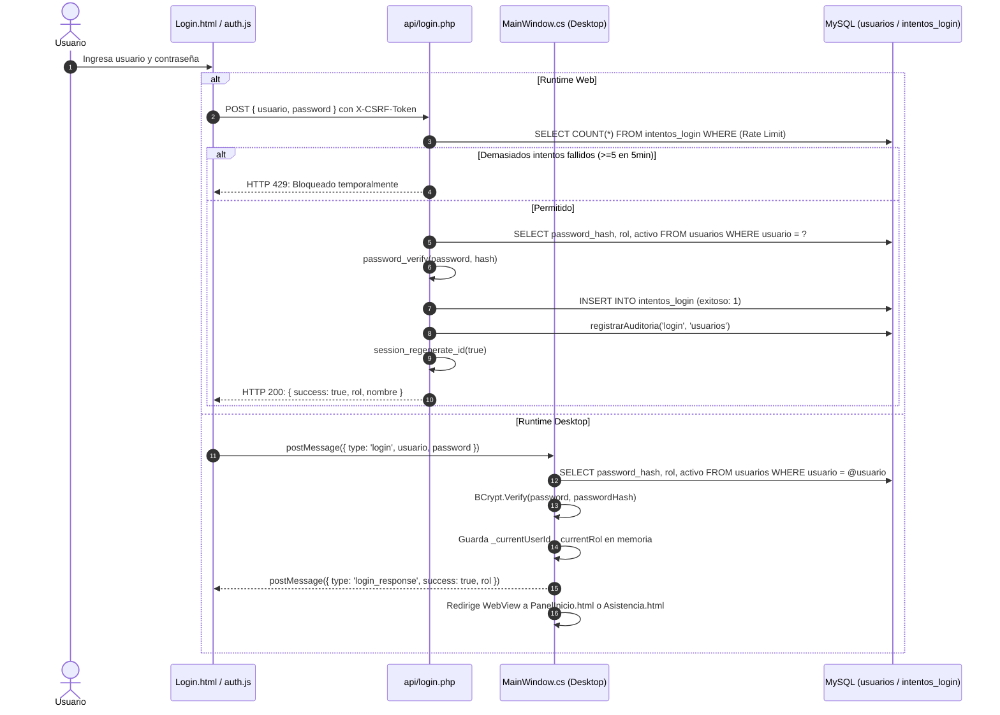
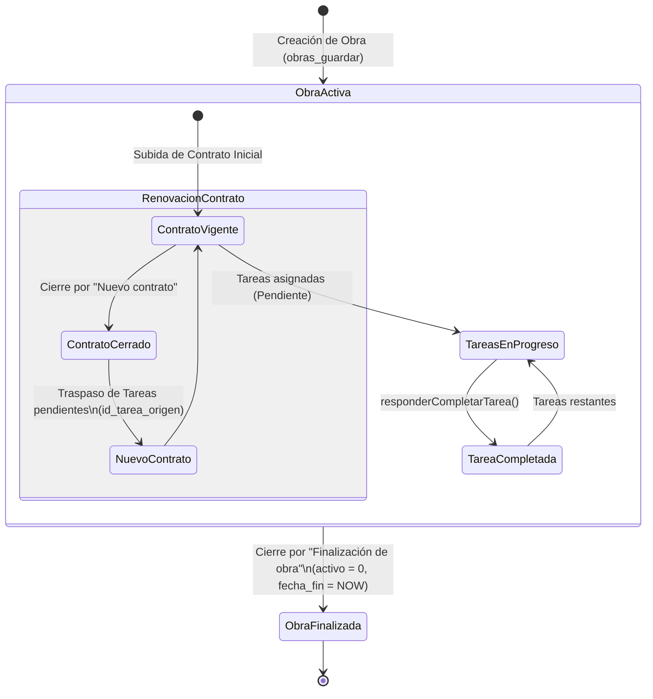
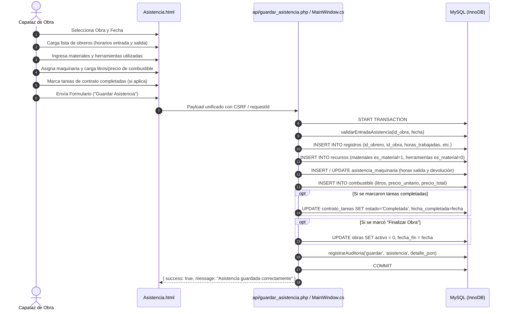
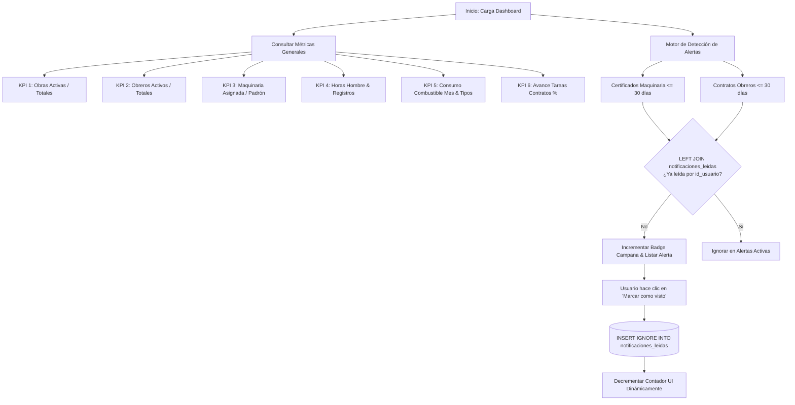
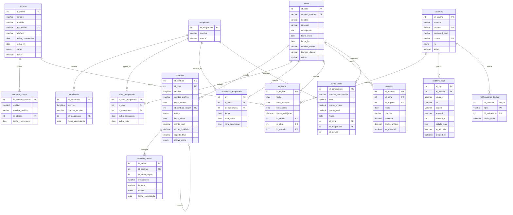

# Manual Técnico y de Mantenimiento Integral — Sistema Pórtico

**Sistema de Gestión Integral de Obras, Personal, Maquinaria y Control Operativo**  
*Documento de Ingeniería de Software para Desarrolladores y Mantenedores*  
**Versión del Sistema:** 2.0 (Dual-Runtime: Web PHP 8+ / Desktop .NET 10 WinForms + WebView2)  
**Fecha de Publicación:** Septiembre de 2026  

---

## Tabla de Contenidos

1. [Introducción y Objetivos de Mantenimiento](#1-introducción-y-objetivos-de-mantenimiento)
2. [Arquitectura del Sistema: Modelo Híbrido Dual](#2-arquitectura-del-sistema-modelo-híbrido-dual)
   - 2.1 [Visión General de la Arquitectura](#21-visión-general-de-la-arquitectura)
   - 2.2 [Modo Web (PHP 8 + Apache / CLI)](#22-modo-web-php-8--apache--cli)
   - 2.3 [Modo Escritorio (.NET 10 + WebView2 IPC)](#23-modo-escritorio-net-10--webview2-ipc)
   - 2.4 [Comparativa y Protocolo de Paridad Obligatoria](#24-comparativa-y-protocolo-de-paridad-obligatoria)
3. [Mapa Mental del Ecosistema Pórtico](#3-mapa-mental-del-ecosistema-pórtico)
4. [Módulos Funcionales y Flujo de Métodos](#4-módulos-funcionales-y-flujo-de-métodos)
   - 4.1 [Módulo de Autenticación y Control de Sesión](#41-módulo-de-autenticación-y-control-de-sesión)
   - 4.2 [Módulo de Obras, Contratos y Tareas](#42-módulo-de-obras-contratos-y-tareas)
   - 4.3 [Módulo de Obreros y Contratos Laborales](#43-módulo-de-obreros-y-contratos-laborales)
   - 4.4 [Módulo de Maquinaria y Certificados Técnicos](#44-módulo-de-maquinaria-y-certificados-técnicos)
   - 4.5 [Módulo de Asistencias, Recursos y Combustible](#45-módulo-de-asistencias-recursos-y-combustible)
   - 4.6 [Módulo de Dashboard, Analíticas y Notificaciones](#46-módulo-de-dashboard-analíticas-y-notificaciones)
   - 4.7 [Módulo de Consultas y Reportes](#47-módulo-de-consultas-y-reportes)
   - 4.8 [Módulo de Usuarios y Logs de Auditoría](#48-módulo-de-usuarios-y-logs-de-auditoría)
   - 4.9 [Módulo de Exportación de Datos a CSV/ZIP](#49-módulo-de-exportación-de-datos-a-csvzip)
5. [Matriz de Referencias Cruzadas y Dependencias de Métodos](#5-matriz-de-referencias-cruzadas-y-dependencias-de-métodos)
6. [Modelo de Base de Datos y Diccionario Relacional](#6-modelo-de-base-de-datos-y-diccionario-relacional)
   - 6.1 [Diagrama Entidad-Relación Consolidado (ERD)](#61-diagrama-entidad-relación-consolidado-erd)
   - 6.2 [Catálogo de Tablas, Claves y Reglas de Integridad](#62-catálogo-de-tablas-claves-y-reglas-de-integridad)
7. [Seguridad y Hardening del Sistema](#7-seguridad-y-hardening-del-sistema)
8. [Guía Paso a Paso para Desarrolladores: Procedimientos de Mantenimiento](#8-guía-paso-a-paso-para-desarrolladores-procedimientos-de-mantenimiento)
   - 8.1 [Cómo agregar un nuevo campo a una entidad existente](#81-cómo-agregar-un-nuevo-campo-a-una-entidad-existente)
   - 8.2 [Cómo crear un nuevo módulo completo](#82-cómo-crear-un-nuevo-módulo-completo)
   - 8.3 [Compilación y Despliegue de la Aplicación de Escritorio](#83-compilación-y-despliegue-de-la-aplicación-de-escritorio)
   - 8.4 [Ejecución del Servidor Web y Suite de Pruebas](#84-ejecución-del-servidor-web-y-suite-de-pruebas)
   - 8.5 [Resolución de Problemas Frecuentes (Troubleshooting)](#85-resolución-de-problemas-frecuentes-troubleshooting)

---

## 1. Introducción y Objetivos de Mantenimiento

El software **Pórtico** es una solución integral orientada a la gestión operativa, laboral y financiera en empresas del sector de la construcción. Su alcance abarca desde el seguimiento en tiempo real del personal obrero en campo y maquinaria pesada, hasta la administración del ciclo de vida de obras, subcontratas, suministros de materiales, abastecimiento de combustible y auditoría estricta de acciones del sistema.

### Objetivo del Documento
Este manual está concebido para ingenieros de software, administradores de bases de datos y equipos de soporte que deban:
1. **Comprender rápidamente la arquitectura interna** sin requerir arqueología de código.
2. **Extender funcionalidades** respetando el estricto principio de **paridad dual** (Web vs. Escritorio).
3. **Depurar fallos en producción**, localizando de inmediato el archivo, método o consulta SQL causante.
4. **Prevenir regresiones de seguridad o integridad referencial** en la base de datos MySQL.

---

## 2. Arquitectura del Sistema: Modelo Híbrido Dual

### 2.1 Visión General de la Arquitectura

Pórtico implementa un patrón arquitectónico altamente eficiente: **un único Frontend (`web-ui`) desacoplado que coexiste con dos Runtimes de ejecución independientes**, compartiendo exactamente la misma base de datos relacional MySQL.

```mermaid
flowchart TB
    subgraph Frontend["Capa de Presentación Compartida (web-ui)"]
        direction TB
        VISTAS["Vistas HTML5 Semánticas\n(Login, Obras, Obreros, Asistencia, etc.)"]
        ESTILOS["CSS Modular & Tokens\n(theme.css, inicio.css, regObras.css)"]
        LOGICA_CLIENTE["Controladores JS Vanilla\n(auth.js, Obras.js, dashboard.js, etc.)"]
        DETECTOR{"auth.js / window.chrome.webview\n¿Detección de Runtime?"}
        
        VISTAS --- ESTILOS
        VISTAS --- LOGICA_CLIENTE
        LOGICA_CLIENTE --> DETECTOR
    end

    subgraph RuntimeWeb["Runtime 1: Servidor Web (PHP 8+)"]
        API_ROUTER["Endpoints API RESTful (api/*.php)"]
        SESSION_MGR["Manejador de Sesiones PHP & Cookies Strict"]
        CSRF_FILTER["Validador Anti-CSRF (X-CSRF-Token)"]
        POST_LIMIT["Detector de Límite post_max_size"]
        PDO_LAYER["Capa PDO MySQL (api/config/db.php)"]
        
        API_ROUTER --> CSRF_FILTER
        CSRF_FILTER --> POST_LIMIT
        POST_LIMIT --> SESSION_MGR
        SESSION_MGR --> PDO_LAYER
    end

    subgraph RuntimeDesktop["Runtime 2: Aplicación Escritorio (.NET 10 WinForms)"]
        EXE_HOST["PorticoDesktop.exe"]
        WV2["Microsoft Edge WebView2 Control"]
        RES_MAPPING["Virtual Scheme (https://portico.desktop/*)\nLectura de Recursos Embebidos (webui.*)"]
        IPC_BRIDGE["MainWindow.cs (OnWebMessageReceived)\nDespacho por type & requestId"]
        MYSQL_CONNECTOR["MySqlConnector Nativo ADO.NET\n(Prepared Statements)"]
        
        EXE_HOST --> WV2
        WV2 --> RES_MAPPING
        WV2 --> IPC_BRIDGE
        IPC_BRIDGE --> MYSQL_CONNECTOR
    end

    subgraph Persistencia["Capa de Persistencia (MySQL 8 / InnoDB)"]
        MYSQL_DB[("Base de Datos: portico\n(schema.sql - 14 Tablas Relacionales)")]
        LOGS_AUDIT[("auditoria_logs & notificaciones_leidas")]
    end

    DETECTOR -->|HTTP(S) estándar| API_ROUTER
    DETECTOR -->|IPC window.chrome.webview| WV2

    PDO_LAYER -->|TCP 3306| MYSQL_DB
    PDO_LAYER -->|Auditoría| LOGS_AUDIT

    MYSQL_CONNECTOR -->|TCP 3306| MYSQL_DB
    MYSQL_CONNECTOR -->|Auditoría| LOGS_AUDIT
```

---

### 2.2 Modo Web (PHP 8 + Apache / CLI)
- **Servidor:** Apache, Nginx o PHP CLI Development Server (`php -S localhost:8000`).
- **Navegación:** El navegador cliente carga los archivos estáticos desde la carpeta `web-ui/`.
- **Comunicación:** Se utiliza la API estándar `fetch()` con `credentials: 'include'`.
- **Seguridad en Transporte:**
  - Envío obligatorio de la cabecera `X-CSRF-Token`.
  - Cookies de sesión configuradas con `SameSite=Strict`, `HttpOnly=true` y `Secure` condicional.
- **Acceso a Datos:** Cada petición instancia el singleton de conexión `conectar()` en `api/config/db.php`, ejecutando transacciones mediante `PDO`.

---

### 2.3 Modo Escritorio (.NET 10 + WebView2 IPC)
- **Host Nativo:** `PorticoDesktop.exe`, compilado bajo el SDK de .NET 10 con `UseWindowsForms=true`.
- **Navegador Embebido:** `Microsoft.Web.WebView2` (basado en el motor Chromium de Edge).
- **Esquema Virtual Seguro:** La ventana de escritorio no levanta un servidor HTTP local en bucle ni abre puertos en `localhost`. En su lugar, utiliza `AddWebResourceRequestedFilter` sobre el esquema virtual:
  ```text
  https://portico.desktop/*
  ```
  Al dispararse una solicitud web, `MainWindow.cs` intercepta el URI mediante `OnWebResourceRequested` y resuelve el contenido leyendo los flujos de bytes embebidos en el propio ejecutable (`Assembly.GetManifestResourceStream`), cuyos nombres lógicos inician con `webui.`.
- **Canal IPC Bidireccional (Inter-Process Communication):**
  - **Cliente a Host (JS $\to$ C#):** `window.chrome.webview.postMessage(JSON.stringify({ type: '...', requestId: '...', ...payload }))`.
  - **Host a Cliente (C# $\to$ JS):** `_webView.CoreWebView2.PostWebMessageAsString(...)` emitiendo un objeto JSON con el mismo `requestId`.
- **Acceso a Datos:** `MainWindow.cs` usa `MySqlConnector` para interactuar directamente con el motor MySQL mediante comandos parametrizados (`MySqlCommand`), sin intermediación de PHP.

---

### 2.4 Comparativa y Protocolo de Paridad Obligatoria

> [!IMPORTANT]
> **REGLA DE ORO DE MANTENIMIENTO:** Cualquier cambio estructural o adición de funcionalidad en los endpoints PHP (`api/`) **DEBE REPLICARSE OBLIGATORIAMENTE** en los métodos despachadores de `desktop-csharp/MainWindow.cs`, y viceversa. Omitir esto quebrará la experiencia en el entorno de escritorio.

| Criterio | Entorno Web | Entorno Escritorio (.NET 10) |
| :--- | :--- | :--- |
| **Punto de Entrada** | `web-ui/Login.html` en navegador | `Program.cs` $\to$ `MainWindow.cs` |
| **Protocolo de Red** | HTTP / HTTPS (REST API) | Virtual Host (`https://portico.desktop/`) + IPC Message Loop |
| **Control de Sesión** | `$_SESSION` de PHP (cookies de servidor) | Variables en memoria de `MainWindow.cs` (`_currentUserId`, etc.) + `sessionStorage` |
| **Validación Anti-CSRF** | Obligatoria vía `X-CSRF-Token` | Innecesaria (aislado del navegador general por contexto de proceso) |
| **Driver de Base de Datos** | PHP `PDO` (MySQL) con Prepared Statements | `MySqlConnector` ADO.NET con Prepared Statements |
| **Manejo de Archivos BLOB** | Multipart Form-Data o Base64 JSON | Base64 JSON o lectura local de streams |

---

## 3. Mapa Mental del Ecosistema Pórtico

A continuación se ilustra la taxonomía general de componentes, tecnologías y responsabilidades que componen el sistema Pórtico:



---

## 4. Módulos Funcionales y Flujo de Métodos

### 4.1 Módulo de Autenticación y Control de Sesión

Este módulo gestiona la seguridad de acceso, protegiendo las rutas según el rol (`Administrador` vs `Capataz`) y limitando ataques de fuerza bruta.



#### Métodos Clave Involucrados:
- **Web:**
  - `iniciarSesion()` (`api/config/session.php`): Establece flags de seguridad de cookies.
  - `validarCsrf()` (`api/config/utils.php`): Aplica `hash_equals()`.
  - `registrarAuditoria()` (`api/config/auditoria.php`): Registra la IP, usuario y timestamp en `auditoria_logs`.
- **Desktop:**
  - `MainWindow.HandleLoginAsync(JsonElement root)`: Consulta parametrizada con `MySqlCommand`.
  - `MainWindow.HandleLogout()`: Limpia el estado de autenticación y devuelve el navegador al login.
- **Frontend:**
  - `auth.js` (`applySession`, `doLogout`): Oculta el DOM con `visibility: hidden` preventivo para erradicar el parpadeo de contenido protegido (*Flash of Unauthenticated Content*).

---

### 4.2 Módulo de Obras, Contratos y Tareas

El ciclo de vida de una obra incluye su creación, subida del contrato legal, definición de tareas con presupuesto, renovación o adenda de contrato y cierre definitivo.



#### Métodos Clave Involucrados:
- **`api/Obras.php`:**
  - `responderListado(PDO $pdo)`: Lista obras con paginación, filtros de estado (`active`/`inactive`) y búsqueda full-text sobre número de contrata, cliente y dirección. Vincula el archivo del último contrato mediante un subquery `INNER JOIN MAX(id_contrato)`.
  - `responderDetalle(PDO $pdo)`: Obtiene la ficha técnica completa: historial de contratos asociados, tareas completadas vs pendientes, resumen de combustible y trabajadores asignados.
  - `responderGuardado(PDO $pdo)`: Ejecuta transacción de creación/actualización. Si se adjunta un archivo, invoca `extraerContratoDesdeCampo()` y `guardarContrato()`.
  - `responderCerrarContrato(PDO $pdo)`: Transiciona el estado del contrato a `'Cerrado'`, registrando el motivo (`'Nuevo contrato'` o `'Finalizacion de obra'`), el monto liquidado y recalculando el importe final. Si se genera una nueva versión del contrato, duplica automáticamente las tareas en estado `'Pendiente'` asignando el `id_tarea_origen`.
  - `responderCompletarTarea(PDO $pdo)`: Cambia el flag a `'Completada'` y sella la fecha de término.
  - `responderDescargaContrato(PDO $pdo)`: Extrae el campo `LONGBLOB` de `contratos` y genera el flujo HTTP con cabeceras `Content-Type` detectadas por extensión y `Content-Disposition: attachment`.
- **`desktop-csharp/MainWindow.cs`:**
  - `HandleObrasListarAsync`, `HandleGuardarObraAsync`, `HandleObrasDetalleAsync`, `HandleObrasCambiarEstadoAsync`, `HandleDescargarContratoAsync`.

---

### 4.3 Módulo de Obreros y Contratos Laborales

Gestiona el padrón de personal operativo, sus categorías profesionales y los contratos laborales en formato digital.

#### Métodos Clave Involucrados:
- **`api/obreros.php`:**
  - `responderListado(PDO $pdo)`: Devuelve la lista paginada de obreros, calculando en tiempo de ejecución los días restantes del último contrato (`DATEDIFF(co.fecha_vencimiento, CURDATE())`) y asignando badges semánticos (`Vencido`, `Próximo a vencer`, `Vigente`).
  - `responderGuardado(PDO $pdo)`: Inserta o actualiza datos biográficos del trabajador con validación de duplicidad de documento de identidad (`SQLSTATE 23000`).
  - `responderSubirContrato(PDO $pdo)` / `responderSubirContratoBase64(PDO $pdo)`: Valida tipos de archivo admitidos (`pdf`, `doc`, `docx`, `jpg`, `png`), limita a 10 MB y persiste en `contrato_obrero`.
  - `responderEditarFechaContrato(PDO $pdo)`: Modifica la fecha de caducidad del contrato sin obligar a resubir el archivo binario.
  - `responderDescargaContratoObrero(PDO $pdo)`: Descarga el archivo adjunto del obrero.
- **`api/obtener_obrero.php`:**
  - Endpoint ligero optimizado para alimentar selectores y autocompletados en los formularios de asistencia y consultas.
- **`desktop-csharp/MainWindow.cs`:**
  - `HandleObrerosListarAsync`, `HandleGuardarObreroAsync`, `HandleEliminarObreroAsync`, `HandleObrerosSubirContratoAsync`, `HandleObrerosContratosListarAsync`, `HandleObrerosContratoDescargarAsync`, `HandleObrerosContratoEditarFechaAsync`.

---

### 4.4 Módulo de Maquinaria y Certificados Técnicos

Administra el parque de maquinaria, asignaciones a obras y el control de vencimientos de revisiones técnicas, certificados de aptitud y pólizas.

#### Métodos Clave Involucrados:
- **`api/maquinaria.php`:**
  - `responderListado(PDO $pdo)`: Lista los equipos indicando si se encuentran actualmente asignados en alguna obra activa (`obra_maquinaria.fecha_retiro IS NULL`).
  - `responderGuardado(PDO $pdo)` / `responderEliminacion(PDO $pdo)`: CRUD de maquinaria.
- **`api/cert_maq.php`:**
  - `responderListado(PDO $pdo)`: Retorna los certificados de una máquina con indicación de días restantes para su vencimiento.
  - `responderSubirMultipart(PDO $pdo)` / `responderSubirBase64(PDO $pdo)`: Inserción en tabla `certificado`.
  - `responderEditarFecha(PDO $pdo)`: Actualización de vigencia del certificado técnico.
  - `responderDescarga(PDO $pdo)`: Emisión del archivo para descarga.
- **`api/alertas_certificados.php`:**
  - Servicio auxiliar que extrae las alertas de maquinaria para el alimentador de notificaciones.
- **`desktop-csharp/MainWindow.cs`:**
  - `HandleMaquinariaListarAsync`, `HandleGuardarMaquinariaAsync`, `HandleEliminarMaquinariaAsync`, `HandleMaquinariaCertificadosListarAsync`, `HandleMaquinariaCertificadoSubirAsync`, `HandleMaquinariaCertificadoDescargarAsync`, `HandleMaquinariaCertificadoEditarFechaAsync`.

---

### 4.5 Módulo de Asistencias, Recursos y Combustible

Es el corazón operativo del sistema. Cada jornada de trabajo, el Capataz o Administrador registra en una única transacción atómica el ingreso/egreso de personal, uso de equipos, insumos consumidos y combustible despachado.



#### Métodos Clave Involucrados:
- **`api/guardar_asistencia.php`:**
  - `validarEntradaAsistencia(?int $id_obra, ?string $fecha)`: Validación estructural de campos base.
  - `calcularHoras(string $entrada, string $salida): float`: Computa la diferencia exacta de tiempo en horas decimales (ej. 8.5 horas).
  - `guardarObreros(...)`: Itera el listado de obreros e inserta registros en `registros`.
  - `guardarMateriales(...)` y `guardarHerramientas(...)`: Persiste filas en `recursos`.
  - `guardarMaquinaria(...)`: Registra salidas y retornos en `asistencia_maquinaria`.
  - `guardarCombustible(...)`: Almacena el volumen, precio y maquinaria vinculada en `combustible`.
  - `finalizarObra(...)`: Desactiva la obra si se marcó el checklist de conclusión.
  - `guardarTareas(...)`: Sella el avance físico de tareas en `contrato_tareas`.
- **`api/datos_asistencia.php`:**
  - Carga los catálogos en lote para optimizar el rendimiento y minimizar llamadas de red.
- **`desktop-csharp/MainWindow.cs`:**
  - `HandleAsistenciaCatalogosAsync`: Carga simultánea de obras, obreros, materiales históricos y maquinaria.
  - `HandleGuardarAsistenciaAsync`: Ejecución transaccional integral mediante `MySqlTransaction`.

---

### 4.6 Módulo de Dashboard, Analíticas y Notificaciones

Provee una cabina de mando visual para la dirección ejecutiva, con 4 KPIs principales, 2 métricas complementarias, gráficos analíticos y un centro de alertas con persistencia de lectura por usuario.



#### Métodos Clave Involucrados:
- **`api/dashboard.php`:**
  - Consulta agregada de KPIs operacionales y financieros.
  - Generación de datasets para Chart.js (distribución de especialidades de obreros, horas insumidas por las 5 principales obras, consumo histórico de combustible por tipo).
  - Consulta de alertas cruzadas contra `notificaciones_leidas` donde `nl.id_referencia IS NULL`.
- **`api/marcar_notificacion.php`:**
  - Inserción individual de `(id_usuario, tipo, id_referencia)` o masiva (`tipo: 'todas'`) mediante `INSERT IGNORE INTO notificaciones_leidas ... SELECT`.
- **`desktop-csharp/MainWindow.cs`:**
  - `HandleDashboardMetricasAsync`: Réplica exacta de métricas y gráficos para la vista de escritorio.
  - `HandleNotificacionMarcarLeidaAsync`: Sincronización de lectura en MySQL.

---

### 4.7 Módulo de Consultas y Reportes

Permite realizar búsquedas históricas y auditorías laborales por trabajador o ventana de tiempo.

#### Métodos Clave Involucrados:
- **`api/consultas.php`:**
  - Procesa filtros por `id_obrero`, `fecha_desde` y `fecha_hasta`.
  - Retorna resumen estadístico: total de obras en las que participó, cantidad de jornadas y total de horas acumuladas.
  - Retorna grilla detallada con orden cronológico descendente.
- **`desktop-csharp/MainWindow.cs`:**
  - `HandleConsultasBuscarAsync`: Construcción dinámica de cláusulas `WHERE` sobre parámetros tipados (`@idObrero`, `@fechaDesde`, `@fechaHasta`), con paginación (`LIMIT @limit OFFSET @offset`).

---

### 4.8 Módulo de Usuarios y Logs de Auditoría

Garantiza la trazabilidad total de todas las acciones del sistema y el control de cuentas de usuarios administrativos y capataces.

#### Métodos Clave Involucrados:
- **`api/usuarios.php`:**
  - Implementa arquitectura RESTful pura:
    - `manejarGet(PDO $pdo)`: Consulta usuario por ID o lista paginada con buscador.
    - `manejarPost(PDO $pdo)`: Creación de cuenta con validación de unicidad de username y hash seguro BCrypt.
    - `manejarPut(PDO $pdo)`: Actualización de datos; permite cambiar contraseña opcionalmente.
    - `manejarDelete(PDO $pdo)`: Desactivación lógica (`activo = 0`). Cuenta con una **regla de seguridad crítica**: no permite desactivar al último administrador del sistema (`SELECT COUNT(*) FROM usuarios WHERE rol = 'Administrador' AND activo = 1`).
- **`api/auditoria.php`:**
  - Endpoint de consulta de `auditoria_logs` con filtros por fecha, usuario, acción (`login`, `crear`, `actualizar`, `eliminar`, `guardar`, etc.) y entidad (`obras`, `obreros`, `maquinaria`, `asistencia`, `usuarios`).
- **`desktop-csharp/MainWindow.cs`:**
  - `HandleUsersListAsync`, `HandleUserGetAsync`, `HandleUserCreateAsync`, `HandleUserUpdateAsync`, `HandleUserDeleteAsync`.

---

### 4.9 Módulo de Exportación de Datos a CSV/ZIP

Provee la exportación de información operativa a formatos estándar de hoja de cálculo compatibles con Microsoft Excel y Google Sheets.

#### Métodos Clave Involucrados:
- **`api/exportar_csv.php`:**
  - `construirCsv(PDO $pdo, string $tipo)`: Genera el dataset correspondiente (`obras`, `obreros`, `maquinaria`, `asistencias`, `auditoria`, `combustible`).
  - `exportarCsv(string $filename, array $columnas, iterable $filas)`:
    - Emite la cabecera `Content-Type: text/csv; charset=utf-8`.
    - Escribe el **BOM UTF-8** (`"\xEF\xBB\xBF"`) para que Excel interprete correctamente tildes y caracteres en español sin corrupción de encoding.
    - Emplea `fputcsv()` transmitiendo directamente a `php://output`.
    - Registra la auditoría del evento con `registrarAuditoria($pdo, 'exportar_csv', ...)`.
  - `exportarZip(...)` / `construirZip(...)`: Permite empaquetar todas las tablas en un único archivo comprimido `.zip`.

---

## 5. Matriz de Referencias Cruzadas y Dependencias de Métodos

La siguiente tabla resume el mapeo directo entre cada acción del frontend, el endpoint PHP correspondiente, las funciones invocadas, el despachador de C# en la app de escritorio y las tablas afectadas:

| Funcionalidad / Acción | Vista UI | Endpoint PHP (`api/`) | Funciones PHP Invocadas | Mensaje IPC C# | Método C# (`MainWindow.cs`) | Tablas MySQL Involucradas |
| :--- | :--- | :--- | :--- | :--- | :--- | :--- |
| **Inicio de Sesión** | `Login.html` | `login.php` | `iniciarSesion()`, `validarCsrf()`, `registrarAuditoria()` | `login` | `HandleLoginAsync` | `usuarios`, `intentos_login`, `auditoria_logs` |
| **Cierre de Sesión** | Global (Navbar) | `logout.php` | `iniciarSesion()`, `registrarAuditoria()` | `logout` | `HandleLogout` | `auditoria_logs` |
| **Listar Obras** | `Obras.html` | `Obras.php?GET` | `responderListado()` | `obras_listar` | `HandleObrasListarAsync` | `obras`, `contratos` |
| **Ficha Detalle Obra** | `Obras.html` | `Obras.php?detalle=ID` | `responderDetalle()` | `obras_detalle` | `HandleObrasDetalleAsync` | `obras`, `contratos`, `contrato_tareas`, `combustible` |
| **Crear / Editar Obra** | `Obras.html` | `Obras.php?POST` | `responderGuardado()`, `guardarContrato()`, `validarTareas()` | `obras_guardar` | `HandleGuardarObraAsync` | `obras`, `contratos`, `contrato_tareas` |
| **Cerrar Contrato Obra** | `Obras.html` | `Obras.php?POST` | `responderCerrarContrato()`, `validarCsrf()` | `obras_cerrar_contrato` | `HandleObrasCerrarContratoAsync` | `contratos`, `contrato_tareas` |
| **Descargar Contrato** | `Obras.html` | `Obras.php?descargar_contrato=ID` | `responderDescargaContrato()` | `obras_descargar_contrato` | `HandleDescargarContratoAsync` | `contratos` |
| **Cambiar Estado Obra** | `Obras.html` | `Obras.php?POST` | `responderCambioEstado()` | `obras_cambiar_estado` | `HandleObrasCambiarEstadoAsync` | `obras` |
| **Eliminar Obra** | `Obras.html` | `Obras.php?DELETE` | `responderEliminacion()` | `obras_eliminar` | `HandleEliminarObraAsync` | `obras` (cascadas) |
| **Listar Obreros** | `RegistrarObrero.html` | `obreros.php?GET` | `responderListado()` | `obreros_listar` | `HandleObrerosListarAsync` | `obreros`, `contrato_obrero` |
| **Guardar Obrero** | `RegistrarObrero.html` | `obreros.php?POST` | `responderGuardado()`, `limpiarTexto()` | `obreros_guardar` | `HandleGuardarObreroAsync` | `obreros` |
| **Subir Contrato Obrero** | `RegistrarObrero.html` | `obreros.php?POST` | `responderSubirContrato()`, `verificarLimitePost()` | `obreros_subir_contrato` | `HandleObrerosSubirContratoAsync` | `contrato_obrero` |
| **Eliminar Contrato Obrero** | `RegistrarObrero.html` | `obreros.php?POST` | `responderEliminarContrato()` | `obreros_contrato_eliminar` | `HandleObrerosContratoEliminarAsync` | `contrato_obrero` |
| **Editar Fecha Contrato Obr** | `RegistrarObrero.html` | `obreros.php?POST` | `responderEditarFechaContrato()` | `obreros_contrato_editar_fecha` | `HandleObrerosContratoEditarFechaAsync`| `contrato_obrero` |
| **Listar Maquinaria** | `Maquinaria.html` | `maquinaria.php?GET` | `responderListado()` | `maquinaria_listar` | `HandleMaquinariaListarAsync` | `maquinaria`, `obra_maquinaria` |
| **Guardar Maquinaria** | `Maquinaria.html` | `maquinaria.php?POST` | `responderGuardado()` | `maquinaria_guardar` | `HandleGuardarMaquinariaAsync` | `maquinaria` |
| **Certificados Maquinaria** | `Maquinaria.html` | `cert_maq.php?GET` | `responderListado()` | `maquinaria_certificados_listar`| `HandleMaquinariaCertificadosListarAsync`| `certificado` |
| **Subir Certificado Maq** | `Maquinaria.html` | `cert_maq.php?POST` | `responderSubirMultipart()`, `responderSubirBase64()` | `maquinaria_certificado_subir`| `HandleMaquinariaCertificadoSubirAsync`| `certificado` |
| **Guardar Asistencia** | `Asistencia.html` | `guardar_asistencia.php` | `guardarObreros()`, `guardarMateriales()`, `guardarMaquinaria()`, `guardarCombustible()` | `asistencia_guardar` | `HandleGuardarAsistenciaAsync` | `registros`, `recursos`, `asistencia_maquinaria`, `combustible`, `contrato_tareas` |
| **Catálogos Asistencia** | `Asistencia.html` | `datos_asistencia.php` | Consulta masiva de tablas maestras | `asistencia_catalogos` | `HandleAsistenciaCatalogosAsync` | `obras`, `obreros`, `recursos`, `maquinaria` |
| **Dashboard & KPIs** | `PanelInicio.html` | `dashboard.php` | Queries de agregación, uniones de alertas | `dashboard_metricas` | `HandleDashboardMetricasAsync` | Múltiples tablas, `notificaciones_leidas` |
| **Marcar Notificación** | `PanelInicio.html` | `marcar_notificacion.php`| Inserción `INSERT IGNORE` | `notificacion_marcar_leida` | `HandleNotificacionMarcarLeidaAsync`| `notificaciones_leidas` |
| **Consultas de Asistencia** | `Consultas.html` | `consultas.php` | Consulta parametrizada con cálculo de horas | `consultas_buscar` | `HandleConsultasBuscarAsync` | `registros`, `obras`, `obreros` |
| **Gestión de Usuarios** | `TablaUsuarios.html` | `usuarios.php` | `manejarGet()`, `manejarPost()`, `manejarPut()`, `manejarDelete()` | `users_list`, `user_create`, etc. | `HandleUsersListAsync`, `HandleUserCreateAsync`, etc. | `usuarios`, `auditoria_logs` |
| **Logs de Auditoría** | `LogsAuditoria.html`| `auditoria.php` | `decodificarDetalle()`, `normalizarFechaFiltro()` | *(Consulta vía Web API)* | *(Consulta vía Web API)* | `auditoria_logs` |
| **Exportación CSV** | `ExportarDatos.html`| `exportar_csv.php` | `construirCsv()`, `exportarCsv()`, `exportarZip()` | *(Descarga directa)* | *(Descarga directa)* | Todas las tablas según `tipo` |

---

## 6. Modelo de Base de Datos y Diccionario Relacional

### 6.1 Diagrama Entidad-Relación Consolidado (ERD)



---

### 6.2 Catálogo de Tablas, Claves y Reglas de Integridad

1. **`usuarios`:** Cuentas del sistema (`Administrador`, `Capataz`). Password en hash BCrypt.
2. **`obras`:** Proyectos de construcción. Llave única en `numero_contrata`. Borrado en cascada hacia sus contratos y asignaciones.
3. **`contratos`:** Contratos legales de obra. `archivo` es de tipo `LONGBLOB` (hasta 4 GB teóricos, limitado a 10 MB por software). `id_contrato_origen` referencia un contrato anterior en caso de adenda/renovación (`ON DELETE SET NULL`).
4. **`contrato_tareas`:** Desglose financiero y físico del contrato. Registra `importe` y estado (`Pendiente`, `Completada`).
5. **`obreros`:** Ficha de personal con DNI/Documento único.
6. **`contrato_obrero`:** Archivos contractuales de personal con `fecha_vencimiento`. Cascada en eliminación del obrero.
7. **`maquinaria`:** Catálogo de vehículos y herramientas pesadas.
8. **`certificado`:** Certificaciones técnicas e inspecciones de maquinaria con fecha de caducidad.
9. **`obra_maquinaria`:** Historial de asignaciones de máquinas a obras con rango de fechas. Llave única `(id_obra, id_maquinaria, fecha_asignacion)`.
10. **`asistencia_maquinaria`:** Registro diario de uso de maquinaria por obra y fecha. Llave única `(id_obra, id_maquinaria, fecha)`.
11. **`registros`:** Asistencia de personal. Clave foránea `id_usuario` con regla `ON DELETE SET NULL` para preservar el historial si un usuario administrador es removido.
12. **`recursos`:** Insumos consumidos en la jornada. `es_material = 1` para materiales, `0` para herramientas.
13. **`combustible`:** Gasto energético con cálculo de `precio_total = litros * precio_unitario`. Vinculación opcional a maquinaria (`ON DELETE SET NULL`).
14. **`notificaciones_leidas`:** Tabla pivote con clave primaria compuesta `(id_usuario, tipo, id_referencia)` para evitar alertas repetidas a usuarios que ya las han descartado.
15. **`auditoria_logs`:** Bitácora inmutable de eventos con detalle estructurado en JSON.
16. **`intentos_login`:** Almacena intentos de acceso fallidos/exitosos por IP y usuario para rate limiting.

---

## 7. Seguridad y Hardening del Sistema

1. **Cifrado de Credenciales:**
   - Compatibilidad total entre PHP (`password_hash` con `PASSWORD_BCRYPT`) y C# (`BCrypt.Net-Next`). Ambos procesan prefijos `$2y$` y `$2a$`.
2. **Mitigación de SQL Injection:**
   - Cero interpolación o concatenación de variables en sentencias SQL.
   - En PHP: `PDO` configurado estrictamente con `PDO::ATTR_EMULATE_PREPARES => false`.
   - En C#: `MySqlCommand.Parameters.AddWithValue(...)` en la totalidad de las consultas.
3. **Control Anti-CSRF:**
   - En modo Web, todas las peticiones mutatorias (`POST`, `PUT`, `DELETE`) exigen la cabecera `X-CSRF-Token` emparejada con `$_SESSION['csrf_token']` mediante `hash_equals()`.
4. **Control de Sobrecarga de Servidor (Payload Overflow):**
   - La función `verificarLimitePost()` en `api/config/utils.php` detecta cuando un usuario sube un archivo que supera `post_max_size` de `php.ini`. Previene el comportamiento por defecto de PHP (que vacía silenciosamente `$_POST` y `$_FILES`) y emite un HTTP 400 legible.
5. **Aislamiento en Modo Escritorio:**
   - DevTools deshabilitadas (`_webView.CoreWebView2.Settings.AreDevToolsEnabled = false`).
   - Menús contextuales deshabilitados (`AreDefaultContextMenusEnabled = false`).
   - Sin puertos TCP locales expuestos; la carga de assets es interna vía memoria mediante `AddWebResourceRequestedFilter`.

---

## 8. Guía Paso a Paso para Desarrolladores: Procedimientos de Mantenimiento

### 8.1 Cómo agregar un nuevo campo a una entidad existente
*Ejemplo: Agregar el campo `numero_poliza` (VARCHAR 100) a la tabla `maquinaria`.*

1. **Modificar Esquema SQL (`schema.sql`):**
   ```sql
   ALTER TABLE maquinaria ADD COLUMN numero_poliza VARCHAR(100) NULL AFTER marca;
   ```
2. **Actualizar Datos de Prueba (`seed_data.sql`):**
   - Añadir valores en las instrucciones `INSERT INTO maquinaria`.
3. **Actualizar API PHP (`api/maquinaria.php`):**
   - En `responderListado`: Agregar `m.numero_poliza` en el `SELECT`.
   - En `responderGuardado`: Capturar `$body['numero_poliza']`, sanear con `limpiarTexto()` e incluir en el `INSERT`/`UPDATE`.
4. **Actualizar Despachador C# (`desktop-csharp/MainWindow.cs`):**
   - En `HandleMaquinariaListarAsync`: Mapear la nueva columna del `reader`.
   - En `HandleGuardarMaquinariaAsync`: Leer la propiedad del `JsonElement` y agregar el parámetro `@numeroPoliza` en el `MySqlCommand`.
5. **Actualizar Frontend (`web-ui/Maquinaria.html` y `maquinaria.js`):**
   - Añadir el campo `<input id="numeroPoliza">` en el modal de edición/creación.
   - Modificar las funciones `cargarTablaMaquinaria()` y `guardarMaquinaria()` en `maquinaria.js`.

---

### 8.2 Cómo crear un nuevo módulo completo

Para crear un nuevo módulo (por ejemplo, *Proveedores*):
1. Crear la tabla en `schema.sql` con `ENGINE=InnoDB DEFAULT CHARSET=utf8mb4 COLLATE=utf8mb4_unicode_ci`.
2. Crear el controlador REST en `api/proveedores.php`, requiriendo `db.php`, `session.php`, `utils.php` y `auditoria.php`.
3. Crear los métodos correspondientes en `desktop-csharp/MainWindow.cs` (ej. `HandleProveedoresListarAsync`, etc.) y agregarlos al `switch (messageType)` en `OnWebMessageReceived`.
4. Crear la vista `web-ui/Proveedores.html` y su script `web-ui/assets/js/proveedores.js`.
5. En `proveedores.js`, implementar la doble vía:
   - Si `window.chrome?.webview` existe, enviar petición por IPC (`sendDesktopRequest`).
   - Si no, ejecutar `fetch('api/proveedores.php', { ... })`.
6. Incluir la prueba de integridad en `tests/run.php`.

---

### 8.3 Compilación y Despliegue de la Aplicación de Escritorio

#### Requisitos Previos:
- SDK de .NET 10.0 instalado (`dotnet --version`).
- Microsoft Edge WebView2 Runtime (instalado por defecto en Windows 10 y 11).
- Archivo `.env` en la raíz del proyecto con credenciales válidas de base de datos.

#### Compilación en Modo Release:
```bash
# Situarse en la raíz del repositorio
dotnet build .\desktop-csharp\PorticoDesktop.csproj -c Release
```

#### Publicación de Ejecutable Autónomo (Self-Contained):
```bash
dotnet publish .\desktop-csharp\PorticoDesktop.csproj -c Release -r win-x64 --self-contained true -p:PublishSingleFile=true
```
El ejecutable final se generará en `desktop-csharp/bin/Release/net10.0-windows/win-x64/publish/PorticoDesktop.exe`.

---

### 8.4 Ejecución del Servidor Web y Suite de Pruebas

#### Levantar Servidor Local con PHP:
```bash
# Opción 1: Mediante el script automático provisto
.\serve.bat

# Opción 2: Manualmente por línea de comandos con soporte para subida de 25 MB
php -d upload_max_filesize=25M -d post_max_size=25M -d memory_limit=256M -S localhost:8000
```
Luego abrir en el navegador web: `http://localhost:8000/web-ui/Login.html`.

#### Ejecución de la Suite de Pruebas Automatizadas:
```bash
php tests/run.php --verbose
```
La suite valida automáticamente:
- Conexión a la base de datos MySQL.
- Presencia de datos maestros mínimos (usuarios, obras, obreros, maquinarias, asistencias).
- Reglas de integridad referencial (columnas nulas y reglas `ON DELETE`).
- Respuestas correctas de endpoints API sin dependencias externas.

---

### 8.5 Resolución de Problemas Frecuentes (Troubleshooting)

1. **Error MySQL `errno 150` al importar `schema.sql`:**
   - *Causa:* Se intentó crear una clave foránea referenciando una tabla aún no creada o con distinto motor/cotejamiento.
   - *Solución:* Asegurarse de que el script contenga `SET FOREIGN_KEY_CHECKS = 0;` al inicio y `SET FOREIGN_KEY_CHECKS = 1;` al final, y que todas las tablas declaren explícitamente `ENGINE=InnoDB DEFAULT CHARSET=utf8mb4`.

2. **La subida de contratos o certificados falla sin mensaje de error en PHP:**
   - *Causa:* El archivo supera el valor de `post_max_size` configurado en `php.ini`.
   - *Solución:* Verificar que `.user.ini` o el comando de arranque de PHP contenga `-d post_max_size=25M -d upload_max_filesize=25M`.

3. **El ejecutable de escritorio abre una ventana en blanco o da error de recurso:**
   - *Causa:* El nombre lógico del recurso embebido no coincide con el archivo en disco.
   - *Solución:* Revisar la regla `<EmbeddedResource Include="..\web-ui\**\*">` en `PorticoDesktop.csproj`. Cualquier archivo agregado en `web-ui` se transforma automáticamente en `webui.<ruta_con_puntos>`. Si se agregó una subcarpeta nueva, verificar que `MapPathToResourceName` en `MainWindow.cs` la mapee correctamente.

4. **Error 403 "Token de seguridad inválido":**
   - *Causa:* La sesión expiró o la cabecera `X-CSRF-Token` no fue adjuntada en el `fetch()`.
   - *Solución:* Recargar la página o invocar `api/csrf.php` para renovar el token antes de disparar peticiones `POST`.
