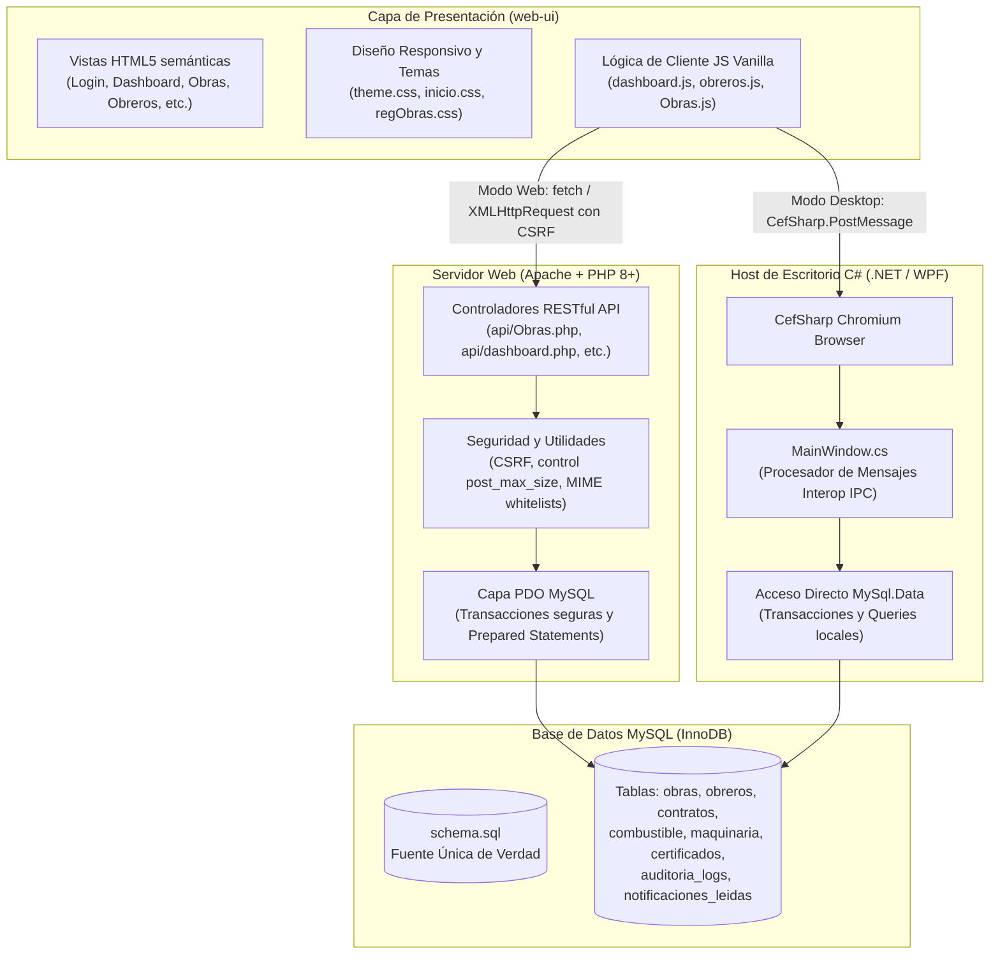
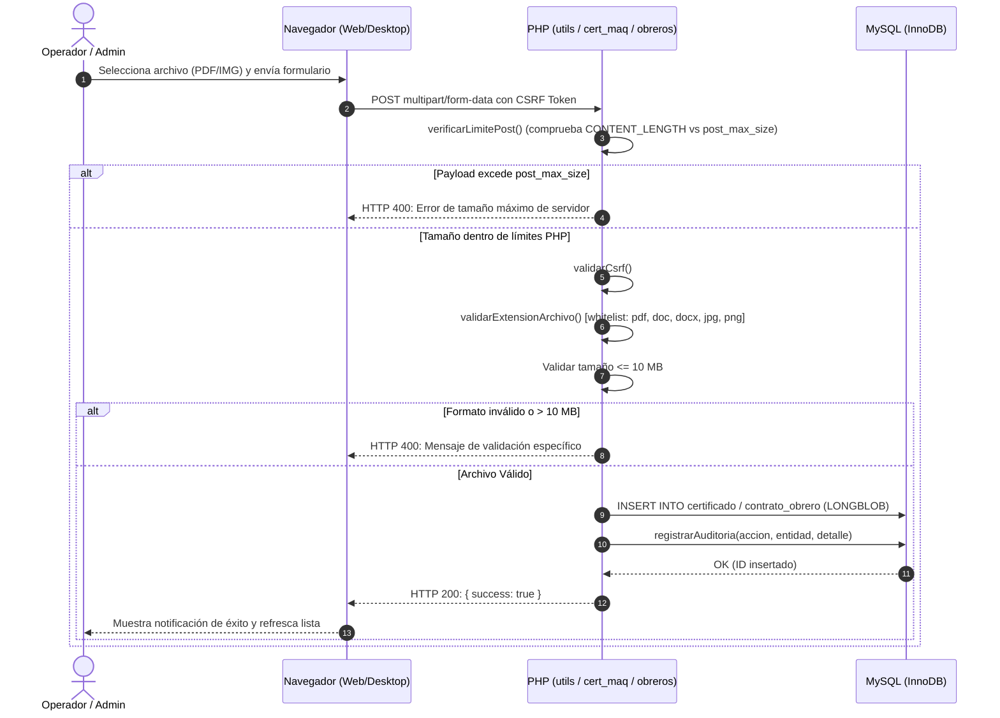
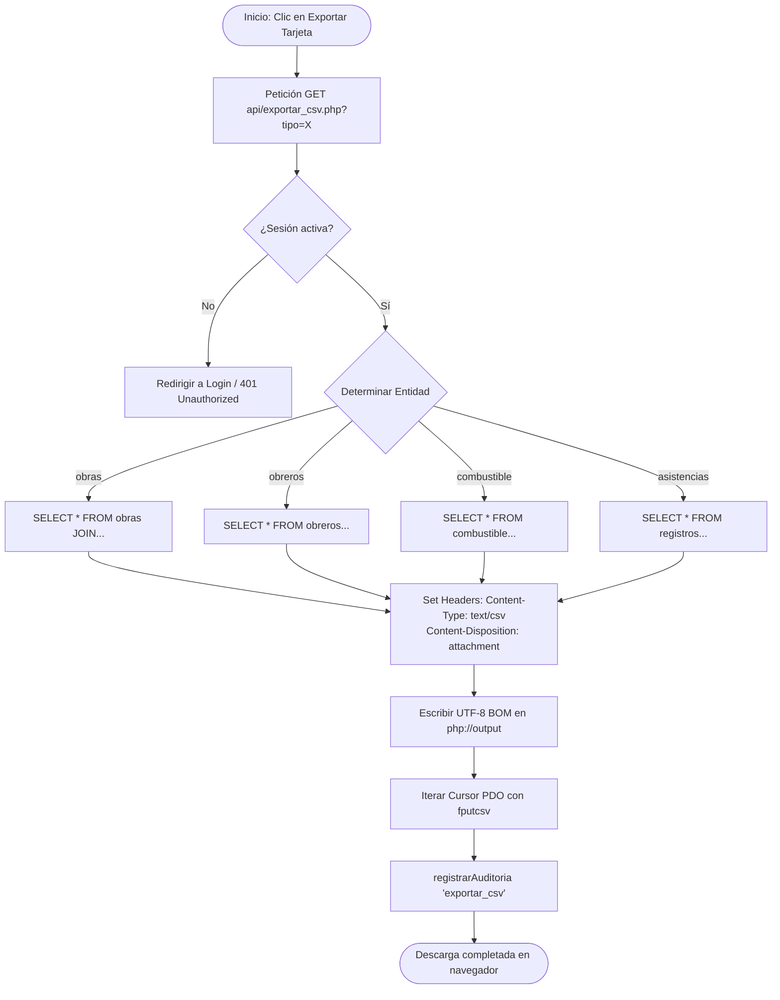
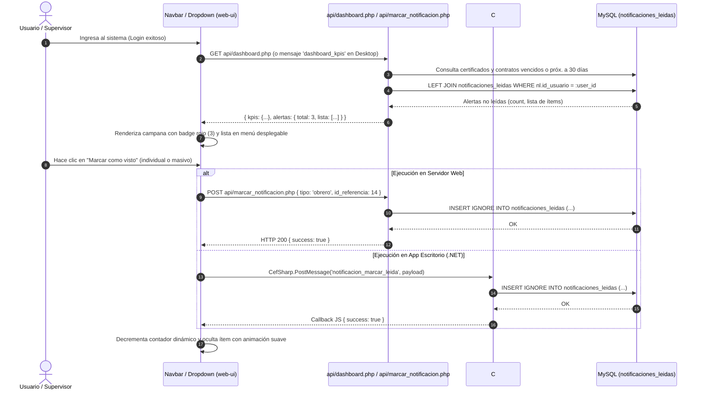
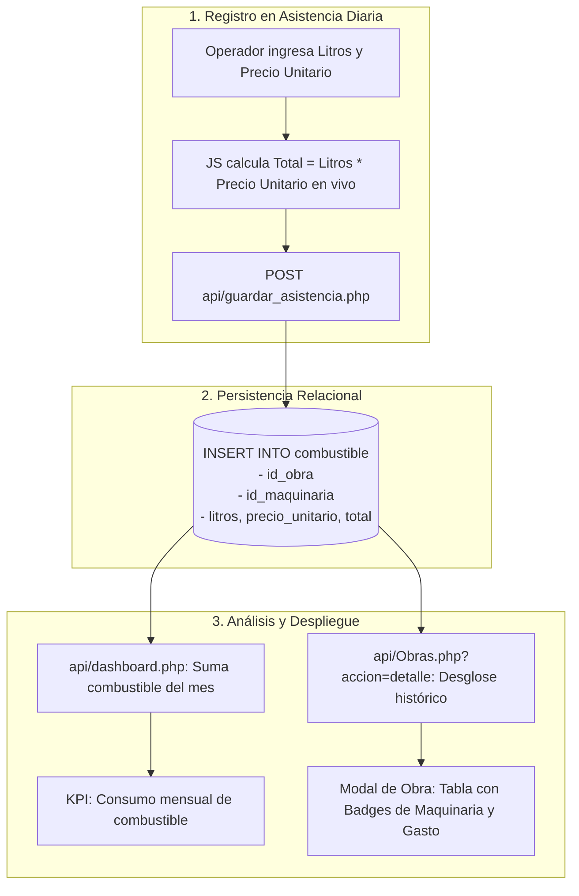
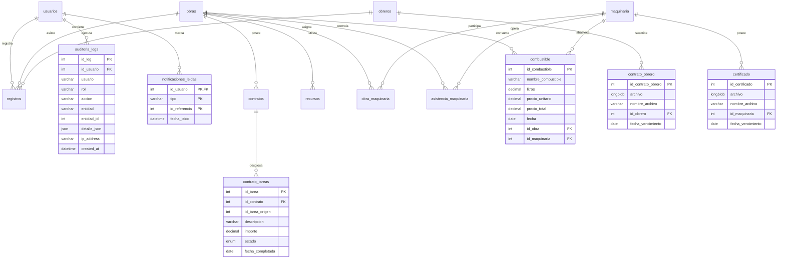

# Historial de Cambios Técnicos - Sistema Pórtico

Documento técnico de control de versiones y registro de cambios arquitectónicos, funcionales y estructurales realizados por el desarrollador **Tiago** desde el inicio de agosto de 2026 en adelante, estructurado formalmente en **Sprint I** y **Sprint II**.

---

## Tabla de Contenidos

1. [Visión General y Arquitectura del Sistema](#visión-general-y-arquitectura-del-sistema)
2. [Sprint I (01/08/2026 - 02/09/2026)](#sprint-i-01082026---02092026)
   - [Registro Cronológico de Commits](#registro-cronológico-de-commits-sprint-i)
   - [Detalle de Módulos y Cambios Implementados](#detalle-de-módulos-y-cambios-implementados-sprint-i)
   - [Diagramas de Flujo y Procesos](#diagramas-de-flujo-y-procesos-sprint-i)
   - [Impacto en Base de Datos y Calidad de Código](#impacto-en-base-de-datos-y-calidad-de-código-sprint-i)
3. [Sprint II (03/09/2026 - Presente)](#sprint-ii-03092026---presente)
   - [Registro Cronológico de Commits](#registro-cronológico-de-commits-sprint-ii)
   - [Detalle de Módulos y Cambios Implementados](#detalle-de-módulos-y-cambios-implementados-sprint-ii)
   - [Diagramas de Flujo y Procesos](#diagramas-de-flujo-y-procesos-sprint-ii)
   - [Impacto en Base de Datos y Arquitectura](#impacto-en-base-de-datos-y-arquitectura-sprint-ii)
4. [Diagrama Entidad-Relación Consolidado](#diagrama-entidad-relación-consolidado)
5. [Guía para Futura Documentación Técnica](#guía-para-futura-documentación-técnica)

---

## Visión General y Arquitectura del Sistema

El sistema **Pórtico** opera bajo una arquitectura híbrida dual concebida para funcionar tanto como una aplicación web tradicional (LAMP/WAMP: PHP + MySQL) como una aplicación de escritorio nativa en Windows (.NET C# con CefSharp / Chromium Embedded Framework), compartiendo la misma interfaz (`web-ui`) y persistencia (`MySQL`).

---

# Sprint I

> **Periodo:** 01 de Agosto de 2026 al 02 de Septiembre de 2026  
> **Autor principal analizado:** Tiago (`camargotiago91@gmail.com`)

### Registro Cronológico de Commits (Sprint I)

| Commit | Fecha y Hora | Mensaje Resumido | Componentes Modificados |
| :--- | :--- | :--- | :--- |
| `84ee6b0` | 2026-08-18 21:22 | `feat: funcionalidad para exportación de datos a CSV` | `api/exportar_csv.php`, `web-ui/ExportarDatos.html`, `exportar.js`, navbars globales |
| `4ff9dd5` | 2026-08-26 20:14 | `fix: control de tamaño en subida de certificados/contratos y nuevas seeds SQL` | `api/config/utils.php`, `api/cert_maq.php`, `api/obreros.php`, `.htaccess`, `.user.ini` |
| `d712ae4` | 2026-08-26 20:32 | `fix: unificar guardado de certificados en maquinaria, actualizar y corregir seeds SQL` | `web-ui/Maquinaria.html`, `web-ui/assets/js/maquinaria.js`, `seed_data.sql` |
| `e204742` | 2026-08-26 21:06 | `feat(ui): estandarizar navegación horizontal, rediseñar dashboard y corregir CSS global` | 29 archivos: `MainWindow.cs`, `inicio.css`, `theme.css`, `dashboard.js`, vistas HTML |
| `9f3e803` | 2026-08-26 21:09 | `Merge branch 'origin/main' with updates for obras, actividades, combustible and UI fixes` | Integración de ramas de colaboradores |
| `b567da1` | 2026-08-26 21:15 | `feat(asistencia): integrar envio y captura de combustible y remover porticocombustible.zip` | `web-ui/Asistencia.html`, eliminación de zip temporal |
| `1c13f55` | 2026-08-26 21:18 | `feat(dashboard): integrar métricas de combustible, avance de contratos, recursos y alertas combinadas` | `api/dashboard.php`, `PanelInicio.html`, `inicio.css`, `dashboard.js` |
| `ade8aed` | 2026-08-26 21:21 | `style(ui): centrar nav-tabs horizontalmente, alinear top-nav y reemplazar iconos por SVG en dashboard` | `PanelInicio.html`, `inicio.css`, `theme.css` |
| `2703b6a` | 2026-08-26 21:23 | `fix(maquinaria): solucionar desbordamiento de botones de certificado con flex-wrap y truncado de texto` | `web-ui/Maquinaria.html`, `web-ui/assets/js/maquinaria.js` |
| `61608a7` | 2026-08-26 21:26 | `fix(maquinaria): asegurar persistencia y carga de fecha de vencimiento al editar certificados` | `desktop-csharp/MainWindow.cs`, `web-ui/assets/js/maquinaria.js` |
| `d5af6fc` | 2026-08-26 21:27 | `fix(exportar): organizar tarjetas de exportación en grilla simétrica 3x2 con estilo moderno e iconos SVG` | `web-ui/ExportarDatos.html` |
| `4d5951c` | 2026-08-26 21:35 | `feat(db): actualizar schema.sql y seed_data.sql con tablas de tareas de contratos y combustible` | `schema.sql`, `seed_data.sql` |
| `061cd44` | 2026-08-26 21:35 | `chore: eliminar archivo temporal de base de datos portico (6).sql` | Eliminación de dump SQL temporal huérfano |
| `8d2357c` | 2026-08-26 21:36 | `fix(db): agregar SET FOREIGN_KEY_CHECKS y ENGINE=InnoDB a todas las tablas para evitar errno 150` | `schema.sql`, `seed_data.sql` |
| `c60c22b` | 2026-08-26 23:50 | `fix: Sub-sección de actividades en obras no recibia datos` | `api/Obras.php`, `MainWindow.cs`, `tests/run.php`, `Obras.js`, `regObras.css` |
| `373b011` | 2026-09-01 19:20 | `feat(env): agregado nuevamente el .env` | `.env.example` |
| `07e307f` | 2026-09-01 19:20 | `Merge branch 'main' of https://github.com/TiagoPereiraC/Portico` | Merge de sincronización de repositorio |
| `61c2b38` | 2026-09-01 20:50 | `fix: Corrección y mejora UI de Obreros: ícono SVG, autocomplete con estilos, navegación responsiva, debounce en búsqueda, alertas en dashboard y CRUD de contratos con modal.` | 22 archivos: `api/obreros.php`, `MainWindow.cs`, `obreros.js`, `RegistrarObrero.html`, `consultas.js` |
| `04066e1` | 2026-09-01 21:09 | `Merge remote-tracking branch 'origin/main' with updates for obras, asistencias, dump SQL and obreros UI` | Merge de cierre de sprint |

---

### Detalle de Módulos y Cambios Implementados (Sprint I)

#### 1. Módulo de Exportación a CSV (`api/exportar_csv.php`, `web-ui/ExportarDatos.html`)
- **Backend:** Creación de un endpoint centralizado que recibe la entidad solicitada (`tipo`: `obras`, `obreros`, `maquinaria`, `asistencias`, `auditoria`, `combustible`).
- **Seguridad:** Verificación de sesión activa y sanitización de cabeceras HTTP (`Content-Type: text/csv; charset=utf-8`, `Content-Disposition: attachment; filename=...`).
- **Formateo de Datos:** Generación de flujos de salida mediante `fputcsv()` a `php://output`, asegurando escape de comas, saltos de línea y codificación UTF-8 con BOM.
- **Frontend:** Vista con diseño de cuadrícula simétrica 3x2 con iconos SVG vectorizados y respuesta visual inmediata.

#### 2. Blindaje y Seguridad en Carga de Archivos (`api/config/utils.php`, `cert_maq.php`, `obreros.php`)
- **Control de Sobrecarga:** Implementación de `verificarLimitePost()`. Cuando un usuario envía un payload que excede `post_max_size`, PHP descarta silenciosamente `$_POST` y `$_FILES`; la función detecta `CONTENT_LENGTH > 0` con variables vacías y arroja una excepción legible antes de provocar inconsistencias.
- **Validación de Tipos y Extensiones:** Lista blanca rigurosa (`pdf`, `doc`, `docx`, `jpg`, `jpeg`, `png`).
- **Límite de Tamaño:** Restricción estricta de 10 MB por archivo (`10 * 1024 * 1024 bytes`) tanto en validación multipart como en base64.
- **Persistencia en BLOB:** Almacenamiento seguro en campos `LONGBLOB` con registro del nombre original del archivo.

#### 3. Rediseño Global de Navegación y UI
- Sustitución de barras de navegación heterogéneas por una barra horizontal unificada en `nav-tabs` y `top-nav`.
- Definición de tokens de diseño en `assets/css/theme.css` para colores de fondo, bordes, estados activos y badges.
- Adopción de iconos SVG nativos integrados directamente en el DOM, eliminando dependencias de fuentes pesadas o imágenes estáticas.

#### 4. Nuevas Entidades en Base de Datos (`schema.sql`)
- **`contrato_tareas`:** Sub-actividades y tareas desglosadas por contrato, registrando `descripcion`, `importe`, `estado` (`Pendiente`/`Completada`) y `fecha_completada`.
- **`combustible`:** Registro volumétrico y financiero del gasto de combustible (`nombre_combustible`, `litros`, `precio_unitario`, `precio_total`, `fecha`, `id_obra`, `id_maquinaria`).
- **Corrección de Claves Foráneas:** Inclusión sistemática de `SET FOREIGN_KEY_CHECKS = 0;` y motor explícito `ENGINE=InnoDB` para erradicar el error de creación `errno 150`.

#### 5. Framework de Pruebas Automatizadas (`tests/run.php`)
- Implementación de un test runner CLI sin dependencias externas (`php tests/run.php`).
- Valida:
  - Integridad mínima de datos (usuarios, obras activas, obreros, maquinarias, asistencias).
  - Integridad de esquema (columnas críticas y reglas `ON DELETE SET NULL` / `CASCADE`).
  - Relaciones referenciales huérfanas en `registros` y `obra_maquinaria`.
  - Respuestas JSON de endpoints API (`obtener_obrero.php`, `consultas.php`).

---

### Diagramas de Flujo y Procesos (Sprint I)

#### A. Flujo de Subida y Validación Segura de Archivos (Contratos y Certificados)

#### B. Flujo del Servicio de Exportación a CSV

---

# Sprint II

> **Periodo:** 03 de Septiembre de 2026 al Presente (09 de Septiembre de 2026)  
> **Autor principal analizado:** Tiago (`camargotiago91@gmail.com`)

### Registro Cronológico de Commits (Sprint II)

| Commit | Fecha y Hora | Mensaje Resumido | Componentes Modificados |
| :--- | :--- | :--- | :--- |
| `b676e83` | 2026-09-08 18:43 | `feat(ui): rediseño panel de inicio e integracion de maquinaria y combustible` | `Asistencia.html`, `PanelInicio.html`, `Asistencias.css`, `inicio.css`, `dashboard.js`, remoción de `portico.zip` |
| `3b51904` | 2026-09-08 19:39 | `fix: Corregido el color del fondo del dashboard` | `Login-style.css`, `inicio.css` |
| `fa2071e` | 2026-09-08 19:45 | `fix: Panel de notificaciones solo se mostraba parcialmente` | `web-ui/assets/css/inicio.css` |
| `6850eec` | 2026-09-08 19:50 | `fix: Arreglada la tabla de obras que se mostraba parcialmente.` | `web-ui/assets/css/regObras.css` |
| `31b33f0` | 2026-09-08 21:12 | `feat: agregado para marcar como visto a una notificacion y mejoras a la UI` | `api/marcar_notificacion.php`, `schema.sql`, `MainWindow.cs`, `dashboard.php`, `dashboard.js`, `inicio.css`, etc. |
| `be18605` | 2026-09-08 21:19 | `Merge origin/main: integra ciclo de vida y renovacion/cierre de contratos y corrige alineacion del menu` | Merge de integración de ciclo de vida de contratos |
| `a2e14be` | 2026-09-08 21:20 | `Merge origin/main con archivos subidos` | Merge de archivos de equipo |
| `44dde80` | 2026-09-08 21:26 | `feat: integra mejoras UI de maquinaria, elimina portico (2).zip y sincroniza schema.sql con dumps` | `schema.sql`, `Asistencia.html`, `Asistencias.css`, eliminación de `portico (2).zip` |
| `8dc311c` | 2026-09-08 21:30 | `fix(seed): ajusta fecha_fin de obrero inactivo en seed_data para pasar suite de tests` | `seed_data.sql` |
| `dbabde1` | 2026-09-09 18:00 | `feat(obras): agregar seccion de combustible en detalles de obra` | `api/Obras.php`, `MainWindow.cs`, `web-ui/Obras.html`, `Obras.js`, `regObras.css` |
| `53691bf` | 2026-09-09 18:10 | `feat: logo circular en login, sincronizacion de schema y actualizacion relacional de seed_data.sql` | `Login-style.css`, `seed_data.sql`, `portico (1).sql` |
| `a3f052f` | 2026-09-09 18:11 | `chore: elimina volcados sql redundantes y los anade a .gitignore para mantener schema.sql como unica fuente de verdad` | `.gitignore`, eliminación de volcados `.sql` en raíz |
| `fe5a812` | 2026-09-15 20:45 | `feat(dashboard): rediseño ejecutivo de cards KPI, desglose de combustible y recursos, finalización de gráficos y corrección de alertas` | `PanelInicio.html`, `inicio.css`, `dashboard.js`, `MainWindow.cs` |

---

### Detalle de Módulos y Cambios Implementados (Sprint II)

#### 1. Arquitectura del Sistema de Notificaciones Persistente
- **Base de Datos:** Creación de la tabla `notificaciones_leidas` (`id_usuario`, `tipo`, `id_referencia`, `fecha_leido`) con clave primaria compuesta `(id_usuario, tipo, id_referencia)` y clave foránea en cascada hacia `usuarios`.
- **Lógica de Filtrado:** El cálculo de alertas en `dashboard.php` efectúa un `LEFT JOIN` con `notificaciones_leidas`. Solo se retornan y contabilizan aquellas alertas cuya tupla no exista para el usuario en sesión.
- **Endpoint `api/marcar_notificacion.php`:**
  - Marcado individual por `tipo` (`'maquinaria'` o `'obrero'`) y su respectivo `id_referencia`.
  - Acción masiva `tipo: 'todas'`, que inserta en bloque todas las alertas pendientes (vencimiento $\le$ 30 días) mediante sentencias `INSERT IGNORE ... SELECT`.
- **Sincronización Nativa en C# (`MainWindow.cs`):** Integración del handler `HandleNotificacionMarcarLeidaAsync` para garantizar paridad inmediata en la aplicación de escritorio.

#### 2. Rediseño Ejecutivo del Dashboard y Asistencias (`inicio.css`, `dashboard.js`, `Asistencias.css`)
- **Jerarquía Visual:**
  - 4 KPIs ejecutivos principales: Obras Activas, Obreros en Obra, Inversión en Combustible del Mes y Horas Hombre acumuladas.
  - 2 métricas operativas de soporte directo.
  - Secciones de gráficos convertidas en bloques colapsables para despejar la vista.
- **Formulario de Asistencia y Combustible:**
  - Nuevas tarjetas de carga para maquinaria con horario de salida/devolución.
  - Campos de entrada reactivos para litros y precio unitario con auto-cálculo en tiempo real en el cliente (`litros * precioUnitario = precioTotal`).

#### 3. Auditoría de Combustible por Obra (`api/Obras.php`, `MainWindow.cs`, `Obras.html`, `Obras.js`)
- En el modal de consulta detallada de obras, se agregó una pestaña/sección dedicada a Combustible.
- Permite auditar fecha, maquinaria asociada, tipo de combustible, volumen suministrado, precio por litro y total consolidado con badges identificadores de color.
- Total acumulado calculado dinámicamente tanto en backend como formateado con estándar monetario en frontend.

#### 4. Gobernanza del Repositorio y Calidad de Código
- **Políticas `.gitignore`:** Inclusión explícita de `portico*.sql`, archivos `.zip` y volcados de backup.
- **Consolidación DDL:** Garantía de que `schema.sql` y `seed_data.sql` constituyan la única fuente de verdad para el despliegue del sistema.
- **Compatibilidad de Tests:** Modificación de `fecha_fin` en `seed_data.sql` asegurando que la suite en `tests/run.php` mantenga una tasa de aprobación del 100%.

#### 5. Modernización Integral del Panel de Control, Métricas Operativas y Notificaciones
- **Rediseño Ejecutivo de Tarjetas KPI (`web-ui/PanelInicio.html`, `web-ui/assets/css/inicio.css`, `web-ui/assets/js/dashboard.js`):**
  - Se conservó la identidad cromática institucional (`--blue`, `--emerald`, `--amber`, `--indigo`) pero reemplazando las tarjetas simples por estructuras informativas completas de nivel ejecutivo.
  - Cada tarjeta incluye ahora: encabezado semántico con icono SVG temático, valor numérico destacado con animación incremental, métrica de contexto secundario, barra de progreso proporcional, fila de micro-estadísticas clave (píldoras comparativas) y botón de acceso rápido con icono de navegación (`Obras`, `Obreros`, `Maquinaria`, `Asistencias`).
- **Desglose Operativo Detallado (Combustible, Tareas de Contrato y Recursos):**
  - Se superó el indicador plano previo dividiendo la sección operativa en una grilla de 3 tarjetas enriquecidas:
    1. **Avance de Actividades de Contrato:** Muestra el porcentaje consolidado, barra de avance dinámica y conteo de tareas completadas vs pendientes.
    2. **Control de Combustible:** Expone el volumen total despachado (en litros), monto acumulado en pesos argentinos (`$`), y chips visuales independientes desglosando litros de **Diesel** y **Nafta**.
    3. **Recursos & Insumos:** Indicador global de elementos inventariados con detalle de materiales de obra vs herramientas de trabajo.
  - Sincronización en backend dual: soporte nativo en `api/dashboard.php` y en el host de escritorio `desktop-csharp/MainWindow.cs` (`combustible`, `actividades`, `recursos`).
- **Terminación y Optimización de Gráficos Analíticos (Chart.js):**
  - Corrección de visualización: el contenedor analítico ahora inicializa visible por defecto (`display: block`) previniendo dimensiones 0x0 en el canvas de Chart.js.
  - **Gráfico Doughnut (Distribución por Cargo):** Implementación de plugin interno de Chart.js (`centroDonaTexto`) que dibuja dinámicamente en el centro del anillo la cifra total de operarios con tipografía corporativa y soporte responsivo.
  - **Gráfico de Barras (Horas por Obra):** Barras estilizadas con gradiente azul-índigo, esquinas redondeadas (`borderRadius: 6`), grilla sutil y formateo de ejes numéricos con sufijo de unidad (`hs`).
- **Resolución de Superposición en Notificaciones de Alertas:**
  - Rediseño estructural de los ítems de alerta en el menú desplegable: se amplió el ancho del dropdown a 530px y se adoptó una arquitectura de doble columna (`.alert-left` y `.alert-actions-col`).
  - `.alert-actions-col` organiza verticalmente el badge de vencimiento arriba y el botón de acción con icono de visto (`✓ Visto`) abajo, evitando choques o superposiciones independientemente de la longitud del texto descriptivo o la cantidad de días transcurridos.
  - Adición de `word-break: break-word` y flex containment en el contenedor de texto de la alerta.

---

### Diagramas de Flujo y Procesos (Sprint II)

#### A. Ciclo de Vida del Sistema de Notificaciones y Marcado de Leídas

#### B. Flujo de Integración de Combustible en Obras y Asistencias

---

## Diagrama Entidad-Relación Consolidado

A continuación se presenta el esquema relacional resultante de los cambios introducidos a lo largo de ambos sprints:

---

## Guía para Futura Documentación Técnica

Para extender y mantener actualizada esta documentación técnica en sprints venideros, se recomienda seguir los siguientes estándares de ingeniería:

1. **Mantenimiento de la Fuente de Verdad:**
   - Modificar las tablas exclusivamente en `schema.sql`.
   - Garantizar compatibilidad hacia atrás en `seed_data.sql`.
   - Ejecutar la suite `php tests/run.php` antes de cada commit mayor.
2. **Convenciones de Commits:**
   - Mantener prefijos semánticos (`feat:`, `fix:`, `style:`, `chore:`, `refactor:`).
3. **Paridad Multiplataforma:**
   - Todo nuevo endpoint añadido en `api/*.php` debe contar con su correspondiente manejador de mensajes en `desktop-csharp/MainWindow.cs` para conservar la funcionalidad de escritorio intacta.
4. **Validaciones de Seguridad:**
   - Mantener el control de tamaño con `verificarLimitePost()`, validación de tipos MIME y token anti-CSRF en todos los formularios de carga de datos sensibles.
